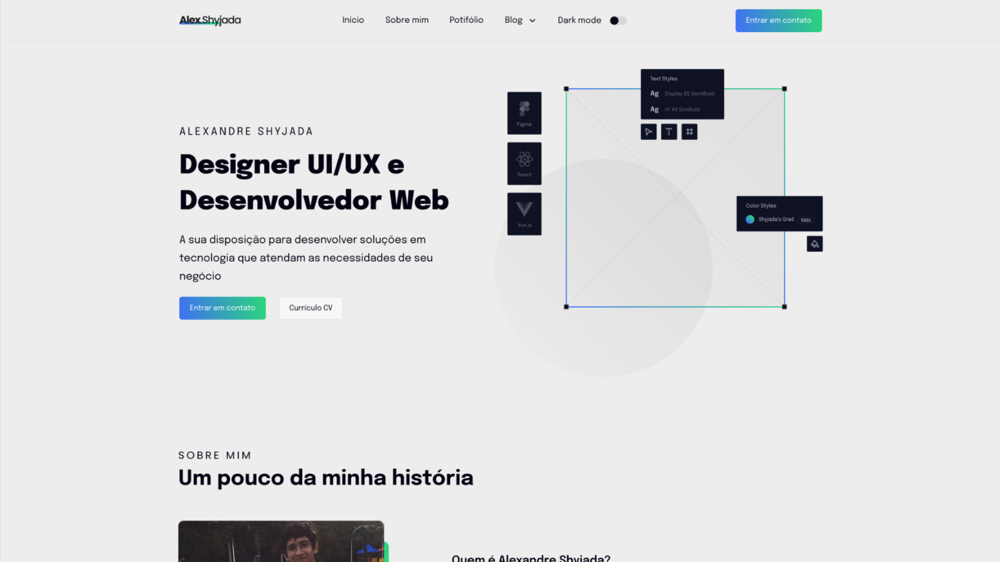
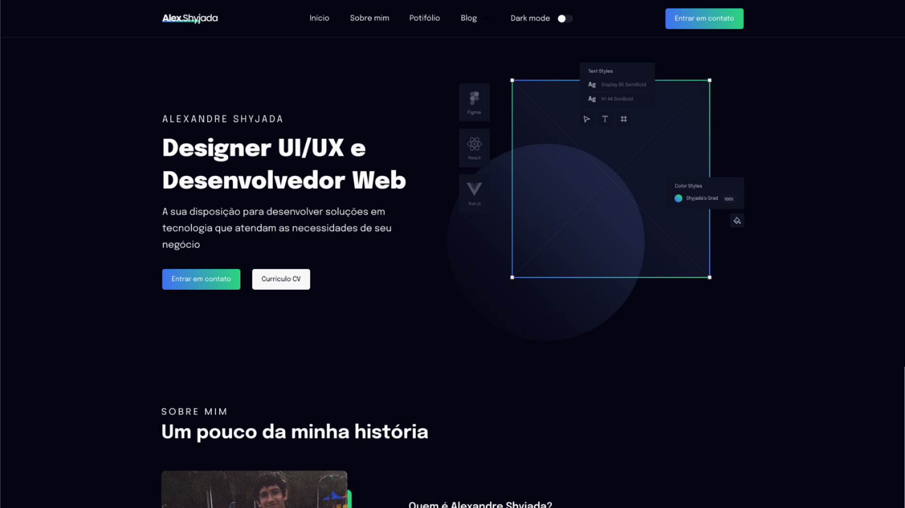

## My curriculum

Esse projeto é basicamente um currículo online com todas as minhas experiencias profissionais

---

## Preview

<p align="center"></p>
<p align="center"></p>

---

## Tecnologias

- [Atomic Design](https://bradfrost.com/)
- [Prismic CMS](https://prismic.io/)
- [Next.js](https://nextjs.org/)
- [Styled Components](https://styled-components.com/)
- [TypeScript](https://www.typescriptlang.org/)

---

### **Iniciando o projeto**

```bash
# Você precisa ter node na sua máquina para rodar o projeto
# Não lembra se possui o node? Execute node -v no seu terminal
$ node -v

# Execute yarn para instalar as dependências
$ yarn

# Execute yarn yarn dev para iniciar a aplicação
$ yarn dev

# A página será aberta em localhost na porta indicada no seu terminal

```

---

Feito por [Alexandre Shyjada](https://www.alexshyjada.com/) 😎
