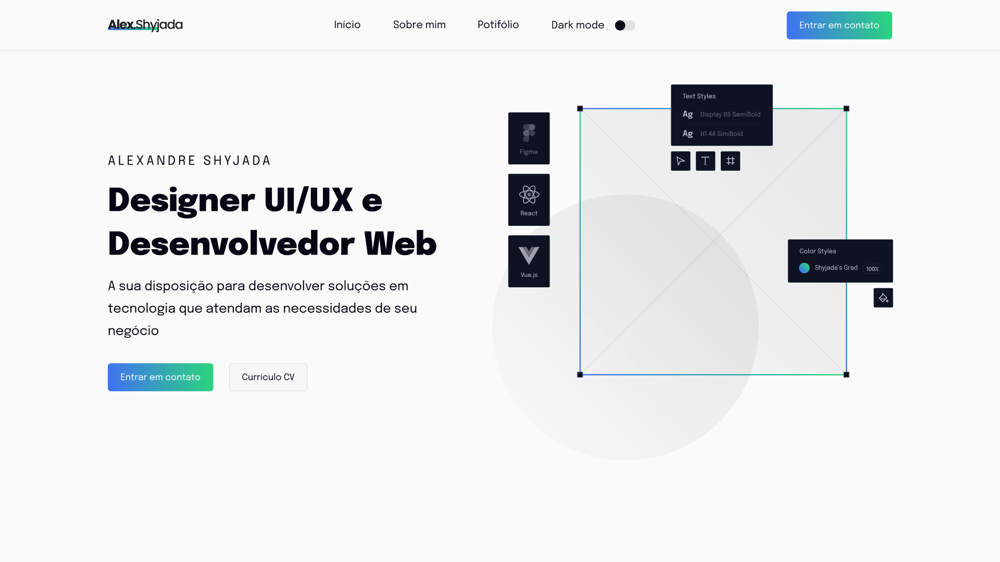

## My portfolio v2

Esse projeto é o inicio da minha jornada como desenvolvedor de Vue. Consiste em uma área de serviços, portifólio, área sobre mim, formulario de contato e blog.

---

## Preview

<p align="center"></p>

---

## Tecnologias

- [Atomic Design](https://bradfrost.com/)
- [Nuxt.js](https://nuxtjs.org/)
- [Sass](https://sass-lang.com/)
- [TypeScript](https://www.typescriptlang.org/)
- [Storyblok CMS](https://www.storyblok.com/?utm_source=google&utm_medium=cpc&utm_campaign=brnd&gclid=CjwKCAjwx8iIBhBwEiwA2quaq0GAmYGwkAgBSw4q_1iBr3-vcXLa4437mIpmEGPE1UwEp8pP7S7uvxoCEYsQAvD_BwE)

---

### **Iniciando o projeto**

```bash
# Você precisa ter node na sua máquina para rodar o projeto
# Não lembra se possui o node? Execute node -v no seu terminal
$ node -v

# Execute yarn install para instalar as dependências
$ yarn install

# Execute yarn run dev para iniciar a aplicação
$ yarn run dev

# A página será aberta em localhost na porta indicada no seu terminal

```

---

Feito por [Alexandre Shyjada](https://www.alexshyjada.com/) 😎
